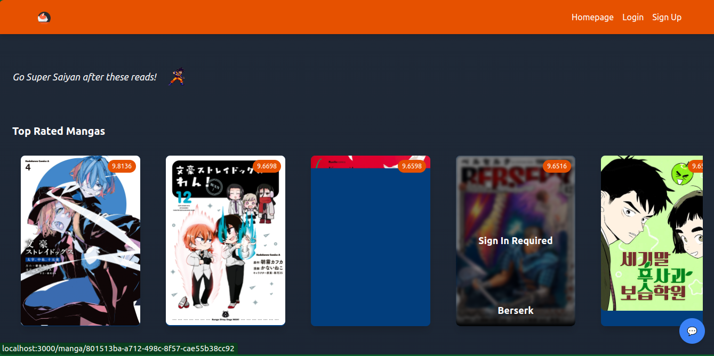
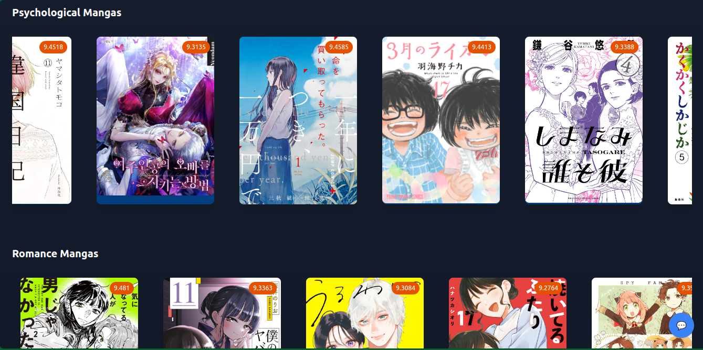
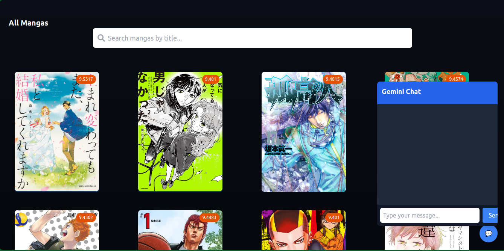
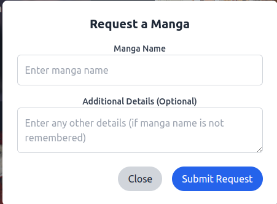
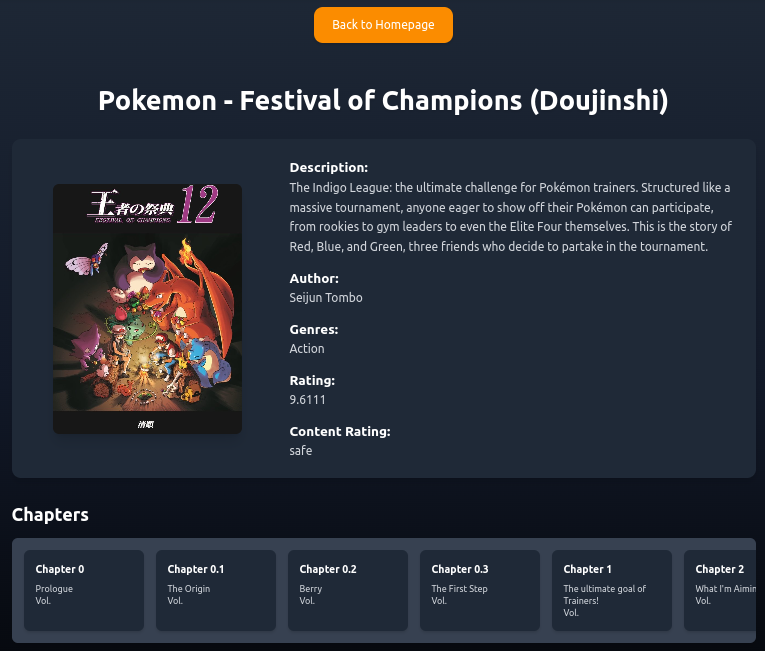
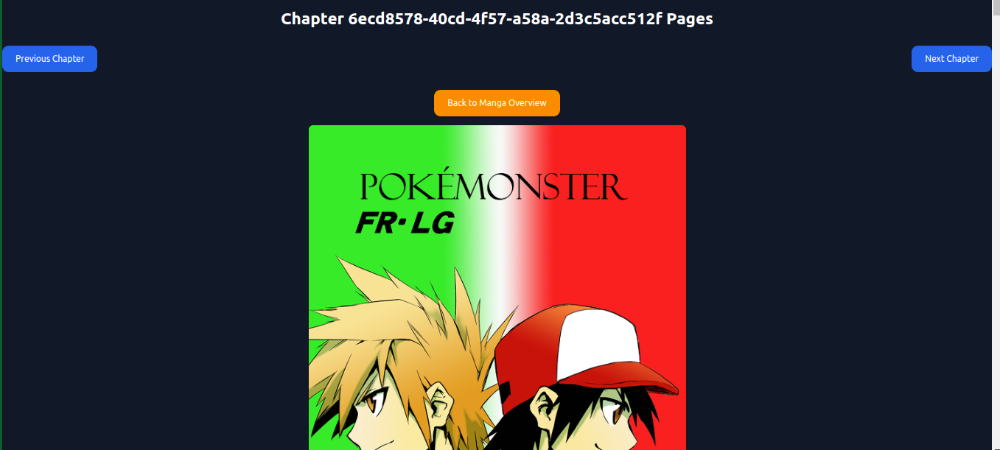
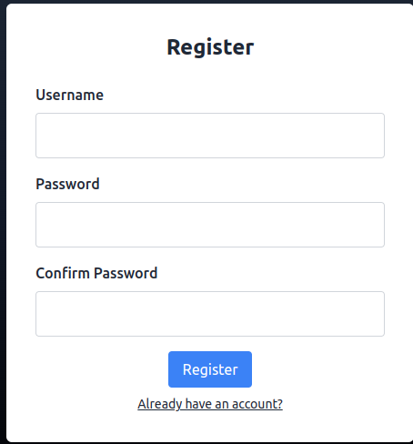
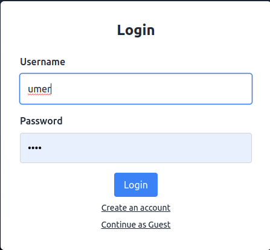
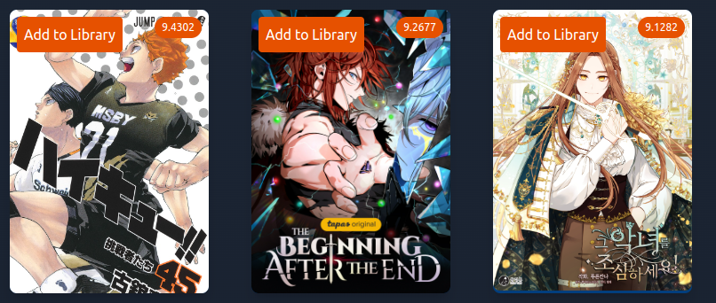
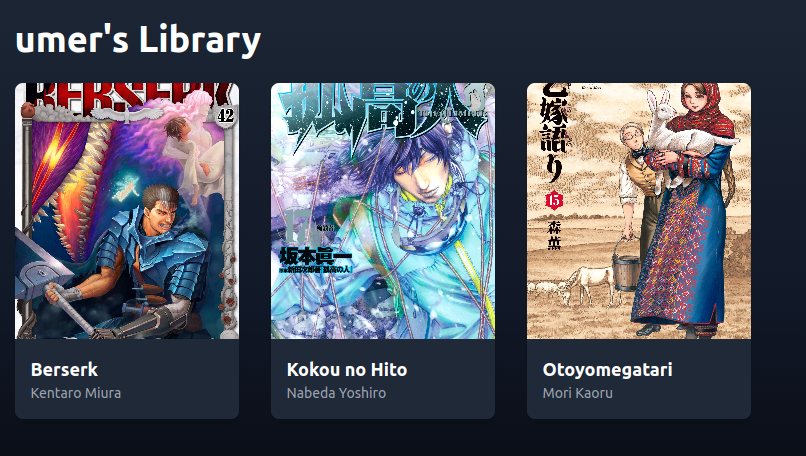

## Project Details

-This is a manga reader app developed using mangadexApi.  
-Developed using MERN. 

## Implementation Details

-Fetches 400 mangas based on rating and stores in mongoDB. 
-Uses the MongoDB database for manga details. 
-Calls the MongoDB on localhost:3010. 

## How to Use:

-git clone to local repository. 
-Execute this command <npm install> in the project folder i.e. manga-e-faiz. 
-execute the /src/data/FetchMangas.js function <node FetchMangas.js> 
-This stores the mangas data in mongoDB. <Line 8: mongoose.connect("");> modify this line according to your string 
-In server.js file give mongoDB connection string. <line 19: mongoose.connect(``)> 
-In /components/GeminiChat.jsx give your geminiApi. <line 8: const geminiApi = "";> 
-In /components/RequestManga.jsx enter your emailjs id. <line 17:> 
-Navigate to /src and execute this command <node server.js>. This connects and runs the database on localhost:3010 

## Screenshots

## Homepage

## Scrollable Cards

## Chatbot integration

## Footer

## Manga Request via emailjs

## Manga Overview

## Reading panel

## Register

## Sign In

## Homepage update after login

## Dashboard for user

